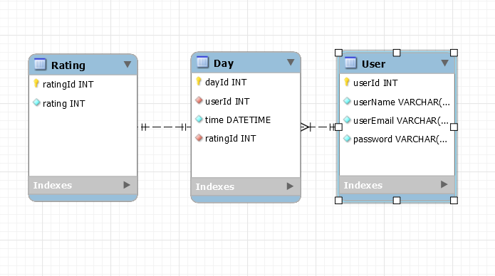

# Meme-otional :stuck_out_tongue_winking_eye:

## *Life is often a blur.* :dizzy_face:

<p> When explaining your wellness to a professional, most people default to saying, “I’m fine.”</p>

<p> This app allows the user to track their ups and down.</p>
 
<p> With a simple but fun format, the user can better articulate their well-being to professionals or simply track their wellness for personal reflection.</p>

<p> The ultimate goal is providing self-awareness that leads to better support and self-accountability.</p>

***

## Technology used :link:

+ <a href="https://reactjs.org">React</a>
+ <a href=https://www.npmjs.com/package/json-server>JSON server</a>
+ <a href="https://react.semantic-ui.com/">Semantic UI - React</a>
+ <a href="https://www.npmjs.com/package/react-chartjs-2">React Chartjs 2</a>

***

## How to install and run :computer:

1. Clone the repository
```
git clone https://github.com/davidnicholastaylor/Meme-otional.git
```

2. Run the JSON server
```
json-server -p 5002 -w self-ware.json
```

3. Start the app
```
npm start
```

***

## Components :open_file_folder:

- Selfware.js
- AppViews.js
- Appviews.css
- Login.js
- Register.js
- data
    - DataManager.js
- days
 DayCard.js
    - DayDate.js
    - DayEdit.js
    - DayForm.js
    - day.css
- images
    - emoji-tongue.png
    - party.gif
    - sad.gif
    - sloth.gif
    - stress.gif
- moods
    - DaysChart.js
    - MoodCharts.js
    - moodChart.css

***


